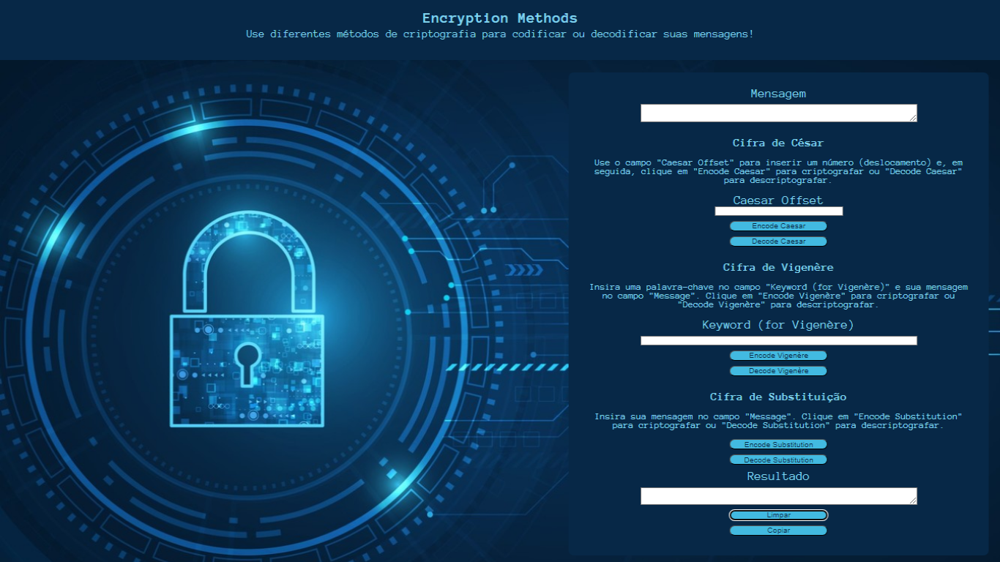

# Encryption Methods

## Índice

* [1. Introdução](#1-introdução)
* [2. Instalação](#2-instalação)
* [3. Uso](#3-uso)
* [4. Decisões Tomadas](#5-decisões-tomadas)
* [5. Atuais Melhorias](#5-atuais-melhorias)
* [6. Layout](#6-layout)

***

## 1. Introdução
A Cifra de César é um método simples de criptografia em que cada letra de uma mensagem é substituída por outra letra que se encontra um número fixo de posições à frente no alfabeto. Por exemplo, se a chave for 3, a letra A é substituída pela letra D, a letra B pela letra E, e assim por diante.

Este método de criptografia foi utilizado pelo Imperador Romano Júlio César para enviar mensagens secretas aos seus generais em tempos de guerra, daí o seu nome.

Embora a Cifra de César seja fácil de entender e implementar, ela é facilmente decifrada por meio de técnicas de análise de frequência, tornando-a inadequada para a criptografia de dados sensíveis. No entanto, ela é frequentemente utilizada em jogos e desafios criptográficos, bem como um exemplo introdutório em cursos de segurança da informação.

Dito isto, decidi adicionar dois novos métodos de criptografia, a Cifra de Vigenère e a Cifra de Substituição.

## Cifra de Vigenère

Cifra polialfabética, um avanço em relação à Cifra de César, que utiliza diferentes deslocamentos em diferentes posições do texto. Ela usa uma palavra-chave para encriptar a mensagem. Por exemplo, se a palavra-chave for "KEY" e a mensagem for "HELLO", ela repetirá a palavra-chave até ter o mesmo comprimento da mensagem (KEYKEYK) e, para cada letra da mensagem, aplicará um deslocamento correspondente à letra da palavra-chave. Esse deslocamento é determinado pela posição da letra na palavra-chave no alfabeto. Por exemplo, se a palavra-chave é "KEY" e a letra da mensagem é "H", o deslocamento será determinado pela letra "K" da palavra-chave. Isso é feito para cada letra da mensagem.

## Cifra de Substituição

Uma das cifras mais simples e antigas. Ela funciona substituindo cada letra do texto original por outra letra do alfabeto de forma consistente. Por exemplo, se a letra "A" é substituída pela letra "D", toda ocorrência da letra "A" na mensagem será trocada por "D". Isso pode ser feito manualmente ou usando uma tabela de substituição predefinida. Por exemplo, se tivermos a substituição: "A" -> "D", "B" -> "E", "C" -> "F", etc., então a palavra "HELLO" se tornaria "KHOOR".

## 2. Instalação

Para instalar este aplicativo, você precisará ter um navegador web moderno instalado. Você pode simplesmente baixar o código-fonte deste repositório e abrir o arquivo index.html no seu navegador para executar o aplicativo. Ou visualizar o link disponibilizado do GitHub Pages.

## 3. Uso

Para usar o aplicativo, basta digitar uma mensagem, seguir as instruções do tipo de método escolhido e clicar no botão "Encode" ou "Decode" para criptografar ou descriptografar a mensagem, respectivamente. O resultado será exibido no campo de saída.

O aplicativo só funciona com letras maiúsculas, então todas as letras minúsculas serão convertidas em maiúsculas automaticamente no resultado.

## 4. Decisões Tomadas

Ao projetar este aplicativo, várias decisões foram tomadas:

* A Cifra de César foi escolhida como o método de criptografia inicial devido à sua simplicidade e facilidade de implementação.
* O aplicativo foi projetado para funcionar apenas com letras maiúsculas para simplificar o código e reduzir o risco de erros.
* Caixas arredondadas foram usadas para tornar as seções de mensagens e resultados visualmente mais atraentes e distinguir dos campos de entrada.
* Botões responsivos foram usados para melhorar a experiência do usuário em diferentes dispositivos e tamanhos de tela.

## 5. Atuais Melhorias

Melhorias adicionadas no aplicativo:

* Permitir que o usuário escolha entre diferentes cifras, como a Cifra de César, Cifra de Vigenere e Cifra de Substituição.
* Adicionado suporte para números e símbolos.
* Melhorias na interface do usuário com estilização e animações mais avançadas, deixando a visualização mais confortável.
* Utilização de Canva para criação de uma paleta de cores que interagisse com o background.
* Adicionado um botão de cópia para a área de transferência para facilitar a cópia da mensagem criptografada ou descriptografada.
* Adicionado um botão "Limpar" para limpar os campos de entrada e saída.

## 6. Layout 

